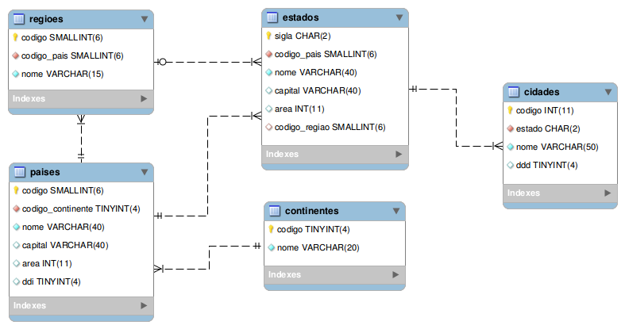
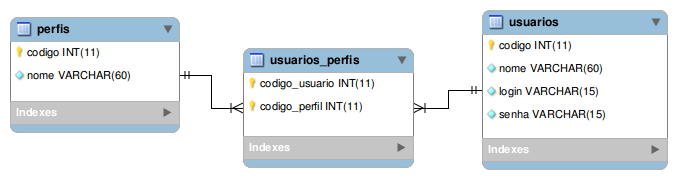
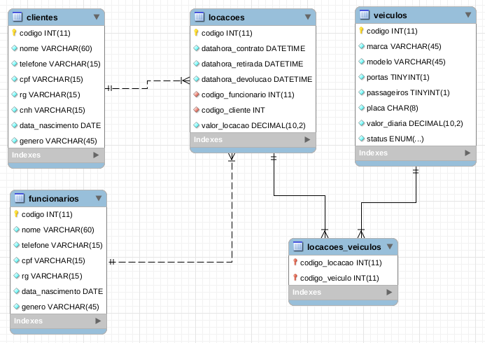
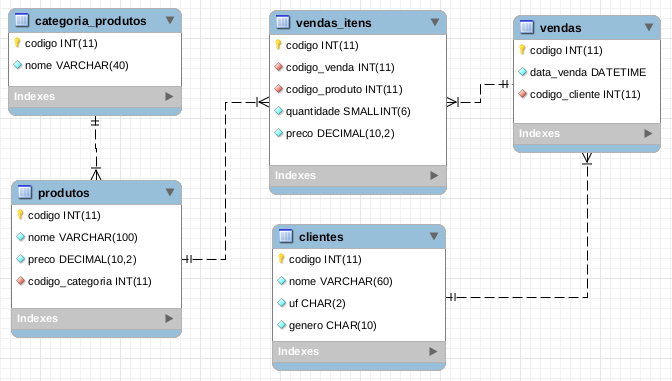

## Sobre
O projeto reúne vários modelos de bancos de dados relacionais para o PostgreSQL. Os modelos podem ser utilizados para testar funcionalidades, testar performance de carga de dados ou servirem de base para a construção de outros bancos de dados.

## Templates disponíveis

### Atlas

### Controle de Acesso

### Locadora de Veículos

### Vendas

## Licença
Este projeto está sob licença do MIT. Para mais detalhes, ver o arquivo LICENSE.
